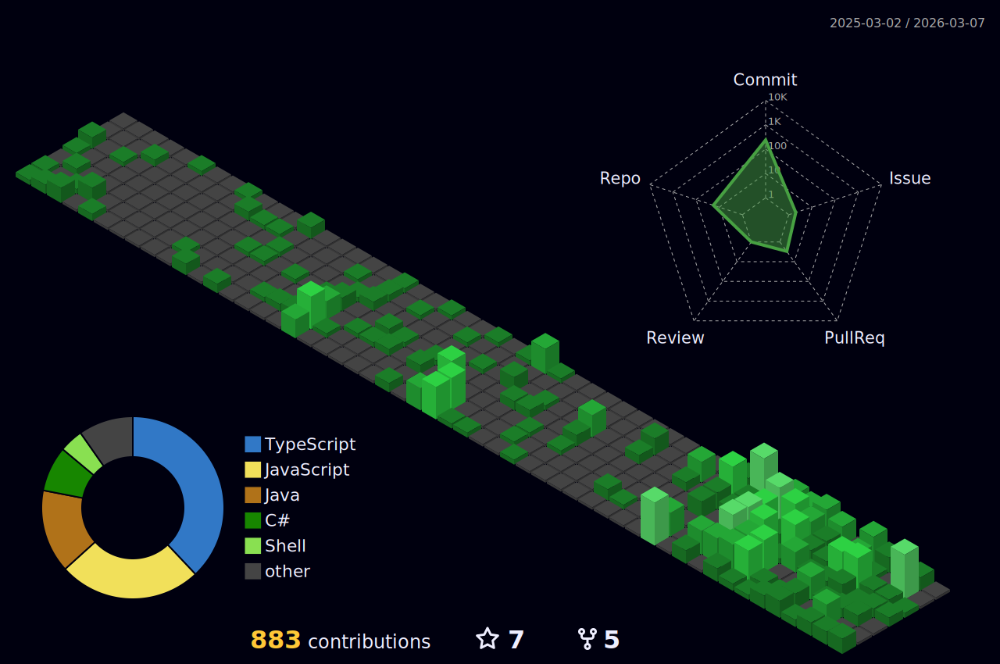

<h1 align="left">Hey 👋 What's up?</h1>

My name is Lakhman and I'm a developer from India.

<h2 align="left">About Me</h2>

✨ Creating bugs since August 2022 📚 Currently learning Java 🎯 Goals: Be a Developer

<h2 align="left">My Projects</h2>

- **Improved CMS (Python Django)**
  - Description: Enhanced canteen management system with dynamic data fetching and Django authentication. Integrated Razorpay for payment processing and DjangoRest for API development.
  - [GitHub](https://github.com/lakhman108/hw_1)
  - [Live Project](https://canteen-sek5.onrender.com)

- **Game Development**
  - Description: Developed interactive games using HTML, CSS, and JavaScript, incorporating DOM manipulation and local storage. Designed SVG animations for engaging user experiences. Learned about Github pages and hosted using that.
  - [GitHub](https://github.com/development.git)
  - [Live Project](https://lakhman108.github.io/development/)

- **SmartStay**
  - Description: Developed REST API endpoints with Java SpringBoot, implementing JPA and security features. Documented 16 RESTful endpoints for various functionalities.
  - [GitHub](https://github.com/lakhman108/smartstay.git)
  - [Live Project](https://smartstay.onrender.com)

<h2 align="left">I Code With</h2>

---

<table>
  <tr>
    <td align="center"> JavaScript</td>
    <td align="center"> TypeScript</td>
    <td align="center"> HTML5</td>
    <td align="center"> CSS3</td>
    <td align="center"> TailwindCSS</td>
  </tr>
  <tr>
    <td align="center"> Bootstrap</td>
    <td align="center"> PHP</td>
    <td align="center"> MySQL</td>
    <td align="center"> Flutter</td>
    <td align="center">  GitHub</td>
  </tr>
</table>

---

<h3 align="center">✨ Check out more awesome tools below! ✨</h3>

  
  
  
  
  
  
  
  
  

  

 

