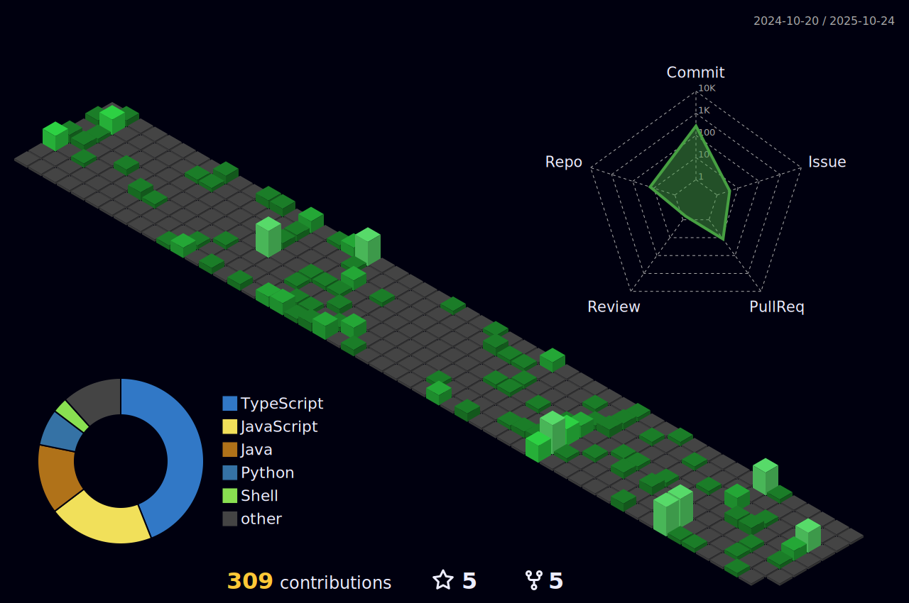

<h1 align="left">Hey 👋 What's up, Code Enthusiast?</h1>

I'm Lakhman, a passionate developer from India, blending creativity and code to craft unique digital experiences.

<h2 align="left">About Me</h2>

✨ Debugging life, one line at a time since August 2022 
🌱 Always learning—currently diving deep into Microservices 
🚀 Mission: To transform ideas into scalable, impactful solutions 
🎯 Goal: Be a developer who leaves a legacy of meaningful software 
🤹 Fun fact: I’m just as skilled in creating bugs as I am in squashing them!

# Projects Portfolio

## Canteen Management System (CMS)

An intuitive canteen management system with seamless data fetching, secure Django authentication, and Razorpay for smooth payments. Deployed on Render for accessible performance, this project helped me master REST APIs and cloud deployments.

### Tech Stack
- Python
- Django
- Supabase
- Razorpay

## SmartStay

Built for students, SmartStay features a REST API-driven platform to simplify accommodation searches. Implemented with JPA for secure and reliable data handling, it's an extensive project documenting 16 endpoints to cater to user needs.

### Tech Stack
- Java Spring Boot
- PostgreSQL
- Supabase

## AgroAdvice

Developed in just 48 hours during a hackathon, this project empowers farmers by identifying crop diseases and recommending treatments. A fast-paced, rewarding challenge where I learned a lot about rapid development and teamwork!

### Tech Stack
- Java Spring Boot
- JWT Auth
- React
- ViteJS

## Sarthi Video Streaming

Inspired by Google Classroom, this adaptive video streaming platform uses the MERN stack and FFMPEG to deliver high-quality video at multiple levels. Scalable and efficient, it supports students with reliable and smooth video content.

### Tech Stack
- ReactJS
- NodeJS
- MongoDB
- FFMPEG

<h2 align="left">💻 My Tech Stack</h2>

<table align="center">
  <tr>
    <td align="center" width="90"> Java</td>
    <td align="center" width="90"> Spring Boot</td>
    <td align="center" width="90"> Node.js</td>
    <td align="center" width="90"> React</td>
    <td align="center" width="90"> JavaScript</td>
    <td align="center" width="90"> TypeScript</td>
  </tr>
  <tr>
    <td align="center" width="90"> Tailwind</td>
    <td align="center" width="90"><iframe src="https://lottie.host/embed/45f9d716-7b12-4e0d-9049-55dbe26dbd17/1Ll1ZnZyah.lottie"></iframe>Python</td>
    <td align="center" width="90"> MongoDB</td>
    <td align="center" width="90"> Django</td>
    <td align="center" width="90"> MySQL</td>
    <td align="center" width="90"> PHP</td>
  </tr>
</table>

## 📊 GitHub Stats

  

## 👀 Profile Views

  

---

Feel free to reach out if you’re interested in collaboration, discussions, or just some good old tech talk! 😄
